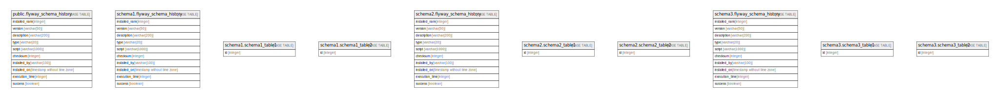

# akkinoc-db

## Tables

| Name | Columns | Comment | Type |
| ---- | ------- | ------- | ---- |
| [public.flyway_schema_history](public.flyway_schema_history.md) | 10 |  | BASE TABLE |
| [schema1.flyway_schema_history](schema1.flyway_schema_history.md) | 10 |  | BASE TABLE |
| [schema1.schema1_table1](schema1.schema1_table1.md) | 1 |  | BASE TABLE |
| [schema1.schema1_table2](schema1.schema1_table2.md) | 1 |  | BASE TABLE |
| [schema2.flyway_schema_history](schema2.flyway_schema_history.md) | 10 |  | BASE TABLE |
| [schema2.schema2_table1](schema2.schema2_table1.md) | 1 |  | BASE TABLE |
| [schema2.schema2_table2](schema2.schema2_table2.md) | 1 |  | BASE TABLE |
| [schema3.flyway_schema_history](schema3.flyway_schema_history.md) | 10 |  | BASE TABLE |
| [schema3.schema3_table1](schema3.schema3_table1.md) | 1 |  | BASE TABLE |
| [schema3.schema3_table2](schema3.schema3_table2.md) | 1 |  | BASE TABLE |

## Relations

---

> Generated by [tbls](https://github.com/k1LoW/tbls)
